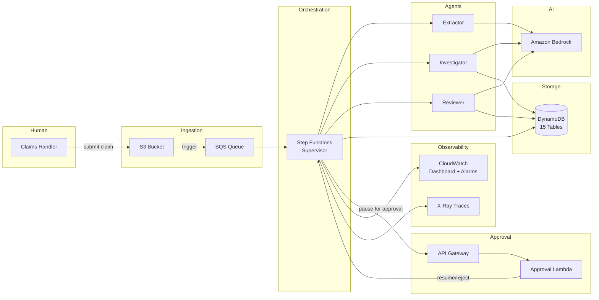
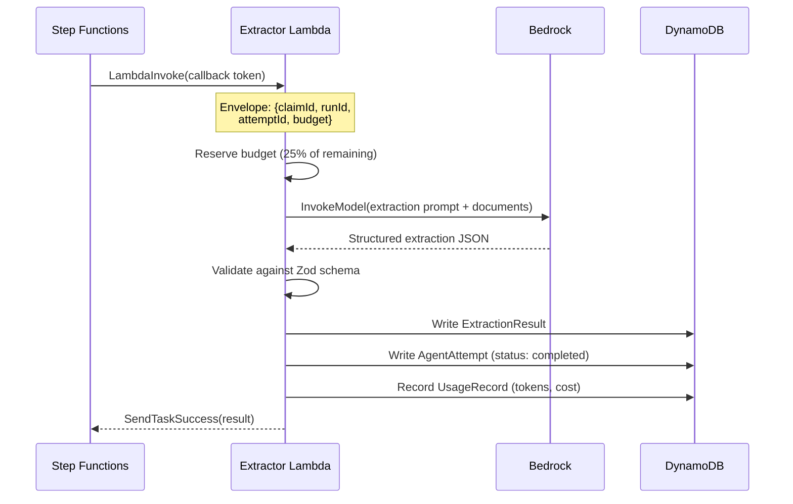
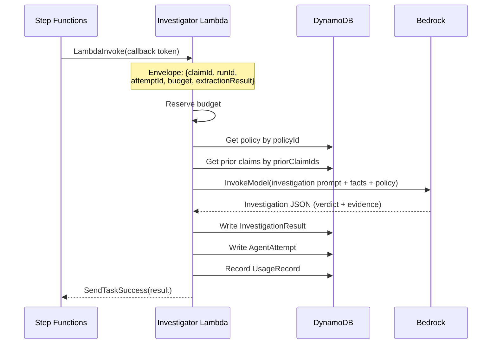
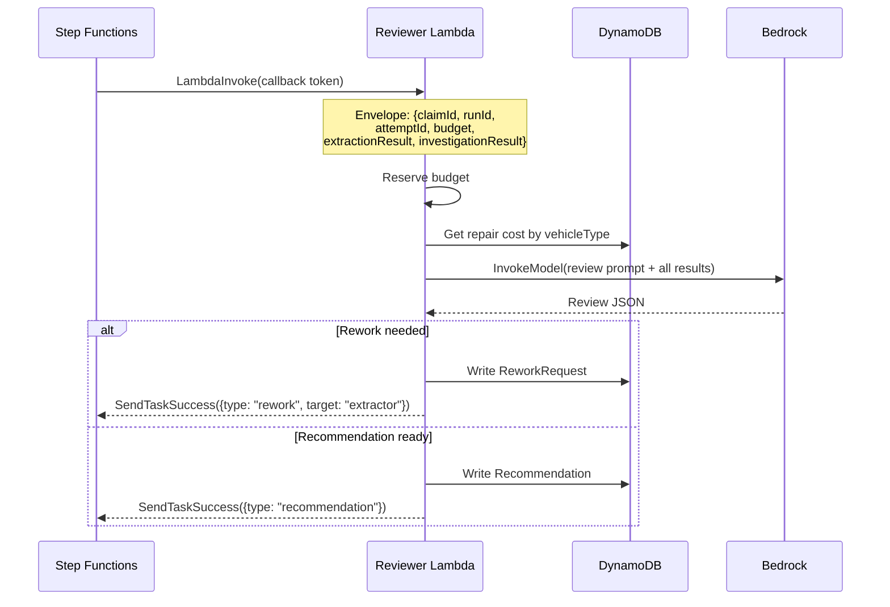
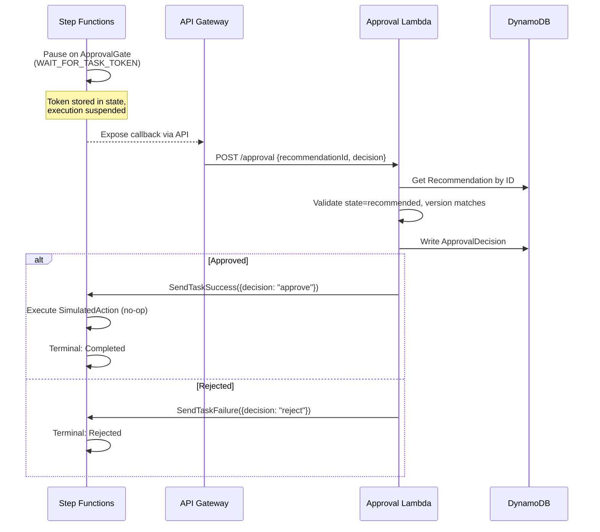
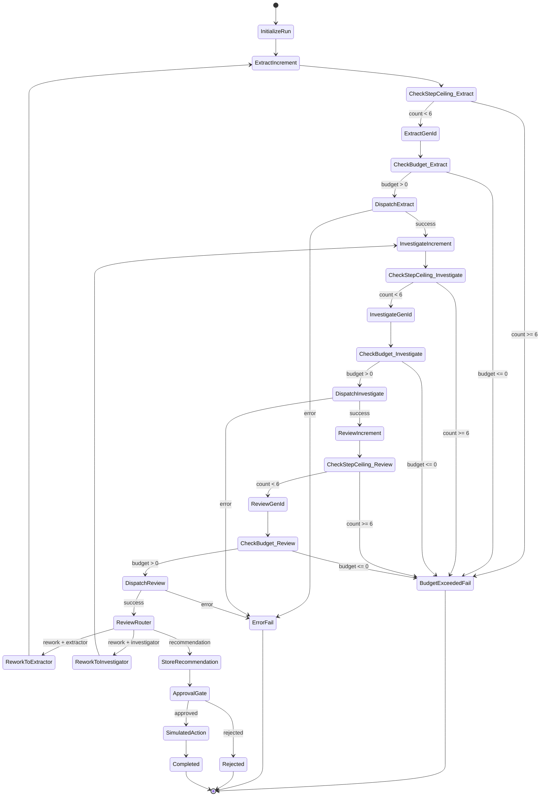
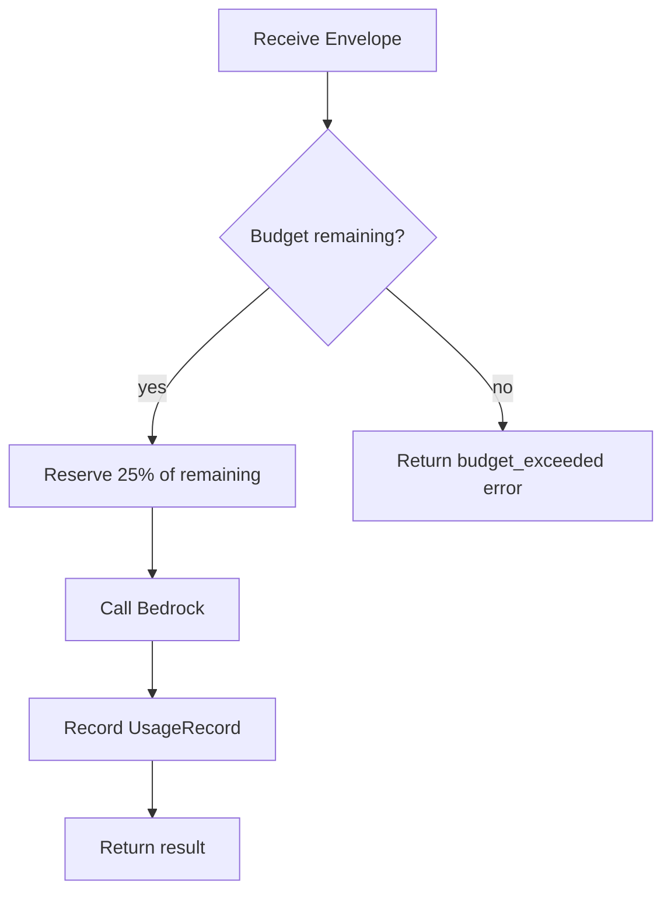
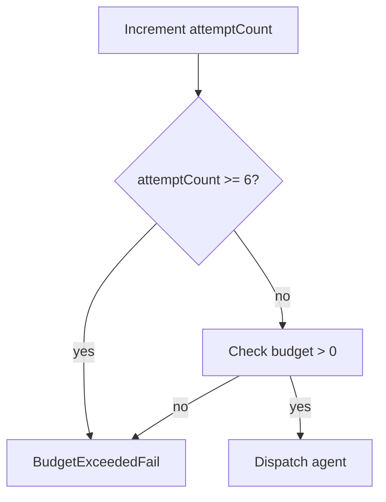

# Verdikt — Multi-Agent Claims Triage on AWS

An open-source, multi-agent insurance claims triage system. Decomposes claims processing into bounded, observable, replayable agents with hard cost ceilings and human approval gates.

## Design Principles

- **Agent isolation** — each specialist (extractor, investigator, reviewer) runs in its own Lambda with its own timeout and memory. One agent crashing does not affect others.
- **Budget enforcement** — every TriageRun gets a $2.00 spending envelope enforced in code, not in prompts. Attempts are capped at 6.
- **Human authorization** — agents recommend. Humans decide. No money moves without an `ApprovalDecision`.
- **Replay safety** — every run state is snapshotted after each successful attempt. A failed run can resume from the last snapshot.
- **Full auditability** — every state transition is an immutable `RunEvent`. Every agent call is an `AgentAttempt`. CloudWatch dashboards and X-Ray traces are generated automatically.

---

## High-Level Architecture



---

## How a Claim Flows Through the System

### Phase 1: Extract

The Extractor receives raw claim documents (accident report, repair estimate, photo description) and extracts structured facts using Bedrock. Each fact is linked to its source document and section via an `EvidenceReference`.



### Phase 2: Investigate

The Investigator cross-checks the ExtractionResult against synthetic policy limits and prior claims. It reads reference data from DynamoDB (exact key lookups, no scans), then uses Bedrock to produce a verdict.



### Phase 3: Review

The Reviewer performs a sanity check. It reads both the ExtractionResult and InvestigationResult, then produces one of:

- **ReworkRequest** → routes back to Extractor or Investigator
- **Recommendation** → versioned written recommendation (proceed, reject, or flag)



### Phase 4: Approval Gate

When the Reviewer issues a Recommendation, the Step Functions state machine **pauses** using `WAIT_FOR_TASK_TOKEN`. The workflow is suspended until a human approves or rejects via the API.



---

## State Machine Graph

The Step Functions supervisor orchestrates all phases. Here is the full state machine:



---

## Budget Enforcement

Every TriageRun starts with a **$2.00 budget** and a **6-attempt ceiling**. These are enforced at two levels:

### Per-Agent Guardrails (in Lambda code)



Each agent reserves 25% of the remaining budget before calling Bedrock. This prevents one expensive agent from starving the others.

### Per-Run Guardrails (in Step Functions)



The Step Functions state machine checks the step ceiling and budget before every dispatch. If either is exceeded, the run terminates immediately with a `budget_exceeded` status.

---

## DynamoDB Schema

All state is stored in DynamoDB with single-table design patterns where appropriate.

### Core Tables

| Table | PK | SK | Purpose |
|---|---|---|---|
| `Claims` | `claimId` | `claimId` | Claim metadata |
| `TriageRuns` | `claimId` | `runId` | Run status, budget, attempt count |
| `AgentAttempts` | `runId` | `attemptId` | Per-agent invocation record |
| `ExtractionResults` | `runId` | `attemptId` | Extractor output |
| `InvestigationResults` | `runId` | `attemptId` | Investigator output |
| `ReviewResults` | `runId` | `attemptId` | Reviewer output |
| `Recommendations` | `runId` | `version` | Versioned recommendations |
| `Approvals` | `recommendationId` | `recommendationId` | Human decisions |
| `Snapshots` | `runId` | `version` | Run state checkpoints |
| `RunEvents` | `runId` | `timestamp` | Immutable audit trail |
| `Budgets` | `runId` | `runId` | Spending envelope |

### Reference Data Tables (read-only)

| Table | PK | Source |
|---|---|---|
| `SyntheticPolicies` | `policyId` | `fixtures/reference/policies.json` |
| `SyntheticPriorClaims` | `priorClaimId` | `fixtures/reference/prior-claims.json` |
| `SyntheticRepairCosts` | `vehicleType` | `fixtures/reference/repair-costs.json` |

---

## Package Structure

```
verdikt/
├── infra/                          # CDK infrastructure
│   └── lib/verdikt-stack.ts        # All 15 tables, SQS, Step Functions, API GW, CloudWatch
├── contracts/                      # Shared data models
│   └── src/schemas.ts              # 15 Zod schemas (Claim, TriageRun, AgentAttempt, etc.)
├── fixtures/                       # Synthetic test data
│   ├── claims/                     # 30 claims with expected outcomes
│   └── reference/                  # Policies, prior claims, repair costs
├── packages/
│   ├── extractor/                  # Extractor Lambda
│   ├── investigator/               # Investigator Lambda
│   ├── reviewer/                   # Reviewer Lambda
│   ├── approval/                   # Approval handler Lambda
│   ├── budget/                     # BudgetStore (reservation-based tracking)
│   ├── snapshot/                   # SnapshotStore + replay handler
│   └── logger/                     # Structured JSON logger + CloudWatch metrics
├── docs/
│   ├── adr/                        # 8 architecture decision records
│   └── Verdikt — Product Requirements Document.md
└── README.md
```

---

## CloudWatch Observability

### Dashboard

The CDK stack creates a `verdikt-operations` dashboard with:

| Widget | Metric | Purpose |
|---|---|---|
| Cost per Claim | `CostPerClaim` (Sum, 5min) | Track spending per run |
| Average Attempt Count | `AttemptCount` (Average, 5min) | Monitor agent efficiency |
| Rework Rate | `ReworkCount / TotalRuns` | Measure extraction/investigation quality |
| Error Rate | `ErrorCount / TotalRuns` | Detect agent failures |

### Alarms

| Alarm | Condition | Action |
|---|---|---|
| Budget Breach | `CostPerClaim > $2.00` | SNS notification |
| Error Rate | `Error / Total > 5%` for 3 periods | SNS notification |

### Structured Logging

All Lambdas emit JSON logs with:

```json
{
  "timestamp": "2025-01-15T10:30:00.000Z",
  "level": "INFO",
  "message": "Extraction completed",
  "claimId": "CLM-001",
  "runId": "run-abc123",
  "attemptId": "att-001",
  "agentType": "extractor",
  "costUsd": 0.12,
  "inputTokens": 1500,
  "outputTokens": 800,
  "durationMs": 3200
}
```

Logs are queryable via CloudWatch Insights using `claimId` and `runId` as indexed fields.

---

## Synthetic Dataset

30 claims covering all expected system behaviors:

| Scenario | Count | Expected Outcome |
|---|---|---|
| Straightforward claims | 8 | Approve on first pass |
| Rework then approve | 6 | Reviewer requests rework, then recommends approval |
| Rework then reject | 5 | Reviewer requests rework, then recommends rejection |
| Budget exceeded | 3 | Attempt ceiling or cost ceiling hit |
| Policy violation | 3 | Investigator flags coverage gap |
| Edge cases | 4 | Zero amount, missing docs, duplicates, invalid input |

Reference data: 8 policies, 7 prior claims, 15 repair cost records.

---

## Setup

### Prerequisites

- Node.js ≥ 20
- AWS CLI configured (`aws configure`)
- AWS CDK v2 (`npm install -g aws-cdk`)
- First deploy: `cd infra && npx cdk bootstrap`

### Install & Build

```bash
npm install
cd infra && npm install
cd .. && npm run build
```

### Deploy

```bash
cd infra && npx cdk deploy
```

Outputs include `StateMachineArn` and `ApprovalApiUrl`.

### Submit a Claim

```bash
aws stepfunctions start-execution \
  --state-machine-arn <StateMachineArn> \
  --input '{"claimId":"CLM-001"}'
```

### Approve a Recommendation

```bash
curl -X POST <ApprovalApiUrl>/approval \
  -H 'Content-Type: application/json' \
  -d '{
    "recommendationId": "<id>",
    "decision": "approve",
    "actor": "human@example.com"
  }'
```

### Run Evaluation

```bash
node scripts/eval.mjs
```

Results written to `eval-results.json`. Each claim's expected outcome is in `fixtures/claims/<claimId>.json` under `expectedOutcome`.

---

## Decision Records

All architecture decisions are documented in `docs/adr/`:

| ADR | Decision | Key Tradeoff |
|---|---|---|
| D1 | Step Functions supervisor | vs. ECS task — simpler ops, lower cost |
| D2 | SQS agent dispatch | vs. direct Lambda invoke — async, decoupled |
| D3 | Bedrock for extraction | vs. Comprehend — structured output control |
| D4 | WAIT_FOR_TASK_TOKEN | vs. polling — human-in-the-loop pause |
| D5 | DynamoDB single-table | vs. RDS — serverless, no connection pools |
| D6 | SimulatedAction (no-op) | vs. real payout — safety for demo |
| D7 | CloudWatch + X-Ray | vs. Datadog — zero additional cost |
| D8 | DynamoDB reference data | vs. S3 — exact key lookups only |

---

## License

MIT
