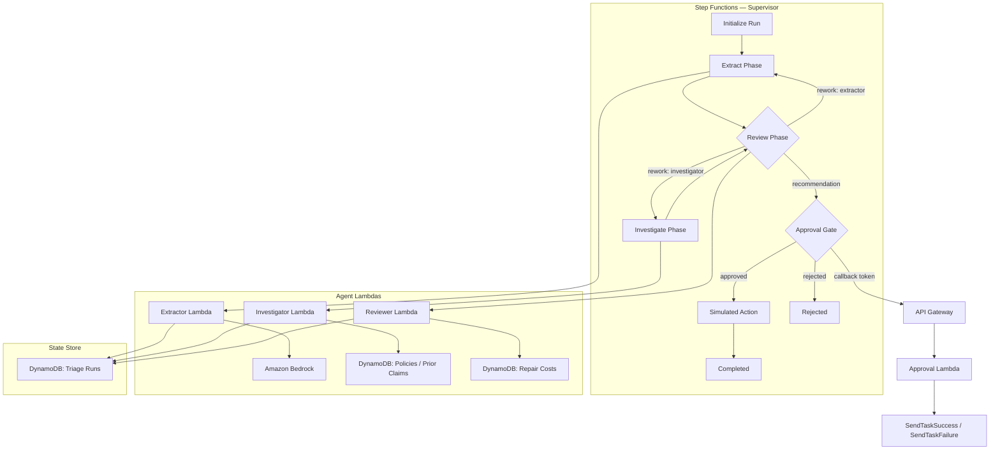
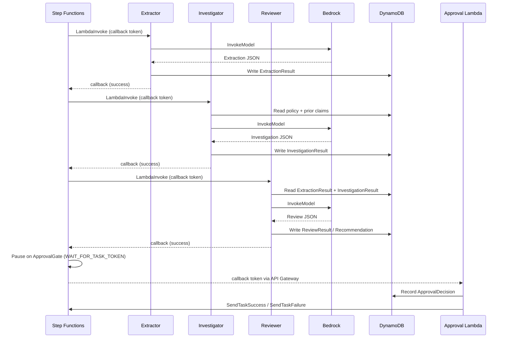

# Verdikt — Multi-Agent Claims Triage on AWS

An open-source, multi-agent insurance claims triage reference architecture on AWS. Decomposes claims processing into bounded, observable, replayable agents with hard cost ceilings and human approval gates.

## Architecture



## Components

| Component | Purpose |
|---|---|
| **Contracts** (`contracts/`) | Zod schemas + JSON Schema exports for all data models |
| **Extractor** (`packages/extractor/`) | Parses claim documents via Bedrock, outputs structured facts |
| **Investigator** (`packages/investigator/`) | Cross-checks facts against synthetic policy limits and prior claims |
| **Reviewer** (`packages/reviewer/`) | Sanity-checks extraction + investigation, issues rework or recommendation |
| **Approval** (`packages/approval/`) | Human approval gate — validates recommendation, records decision, resumes workflow |
| **Budget** (`packages/budget/`) | Per-run token/dollar cost tracking with reservation-based guardrails |
| **Snapshot** (`packages/snapshot/`) | Durable run state checkpoints for resume-after-failure |
| **Logger** (`packages/logger/`) | Structured JSON logging + CloudWatch metrics emission |
| **CDK** (`infra/`) | Full infrastructure: DynamoDB, SQS, Step Functions, API Gateway, CloudWatch |

## Infrastructure

| Resource | Description |
|---|---|
| `VerdiktClaims` | Claims table |
| `VerdiktTriageRuns` | TriageRun state |
| `VerdiktAgentAttempts` | Agent attempt tracking |
| `VerdiktExtractionResults` | Extractor output |
| `VerdiktInvestigationResults` | Investigator output |
| `VerdiktReviewResults` | Reviewer output |
| `VerdiktRecommendations` | Versioned recommendations |
| `VerdiktApprovals` | Approval decisions |
| `VerdiktSnapshots` | Run snapshots |
| `VerdiktRunEvents` | Audit trail |
| `VerdiktBudgets` | Per-run spending envelopes |
| `VerdiktSyntheticPolicies` | Reference data (read-only) |
| `VerdiktSyntheticPriorClaims` | Reference data (read-only) |
| `VerdiktSyntheticRepairCosts` | Reference data (read-only) |
| `VerdiktAgentHandoffQueue` | SQS dispatch queue |
| `VerdiktApprovalCallbackQueue` | SQS approval callback |
| `VerdiktSupervisor` | Step Functions state machine |
| `VerdiktApprovalHandler` | Approval API Lambda |
| `VerdiktApi` | API Gateway (POST /approval) |

## Data Flow



## Setup

### Prerequisites

- Node.js ≥ 20
- AWS CLI configured with credentials
- AWS CDK v2 (`npm install -g aws-cdk`)

### Install

```bash
npm install
cd infra && npm install
```

### Build

```bash
npm run build        # builds all packages
cd infra && npx cdk synth
```

### Deploy

```bash
cd infra && npx cdk deploy
```

### Run

Submit a claim:

```bash
# Start the state machine
aws stepfunctions start-execution \
  --state-machine-arn <StateMachineArn> \
  --input '{"claimId":"CLM-001"}'
```

Approve a recommendation:

```bash
curl -X POST <ApprovalApiUrl>/approval \
  -H 'Content-Type: application/json' \
  -d '{"recommendationId":"<id>","decision":"approve","actor":"human@example.com"}'
```

## Synthetic Dataset

30 claims in `fixtures/claims/` covering:

| Scenario | Count |
|---|---|
| Straightforward (approve) | 8 |
| Rework then approve | 6 |
| Rework then reject | 5 |
| Budget exceeded | 3 |
| Policy violation | 3 |
| Edge cases (zero amount, missing docs, duplicates) | 4 |

Reference data: 8 policies, 7 prior claims, 15 repair cost records in `fixtures/reference/`.

## Evaluation

Run the 30-claim evaluation:

```bash
# From repo root
node scripts/eval.mjs
```

Results are printed to stdout and written to `eval-results.json`. Expected outcomes per claim are in `fixtures/claims/<claimId>.json` under `expectedOutcome`.

## Decision Records

Architecture decisions are in `docs/adr/`:

| ADR | Decision |
|---|---|
| D1 | Supervisor architecture |
| D2 | Claim submission |
| D3 | Document parsing |
| D4 | Agent dispatch |
| D5 | State storage |
| D6 | Confirmation/payout |
| D7 | Observability |
| D8 | Reference data |

## License

MIT
