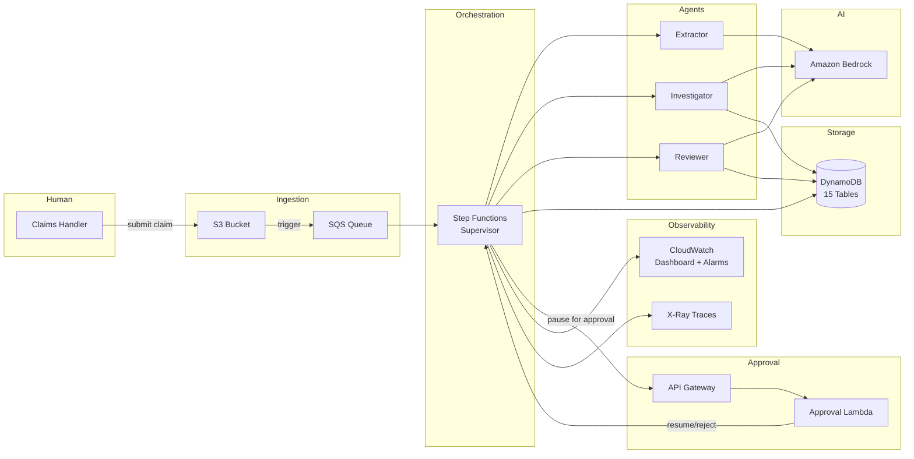
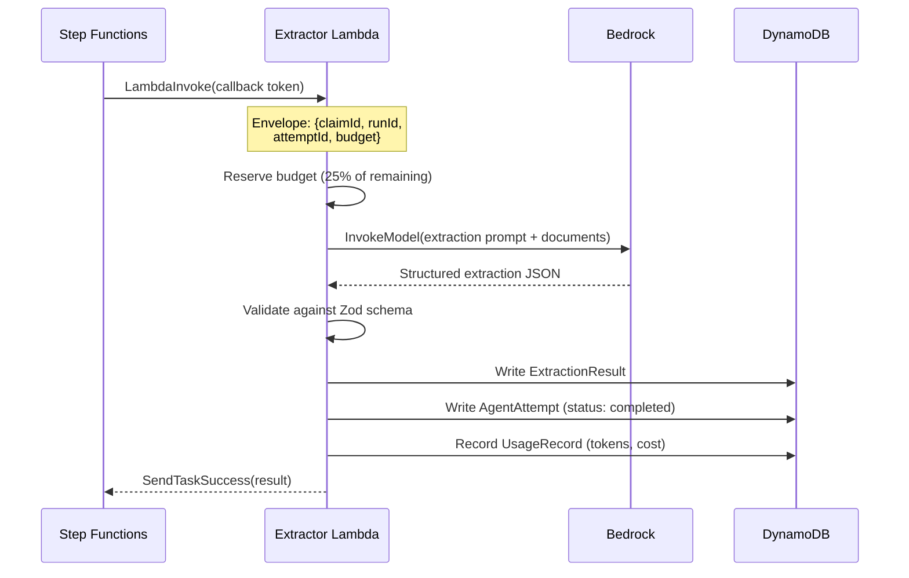
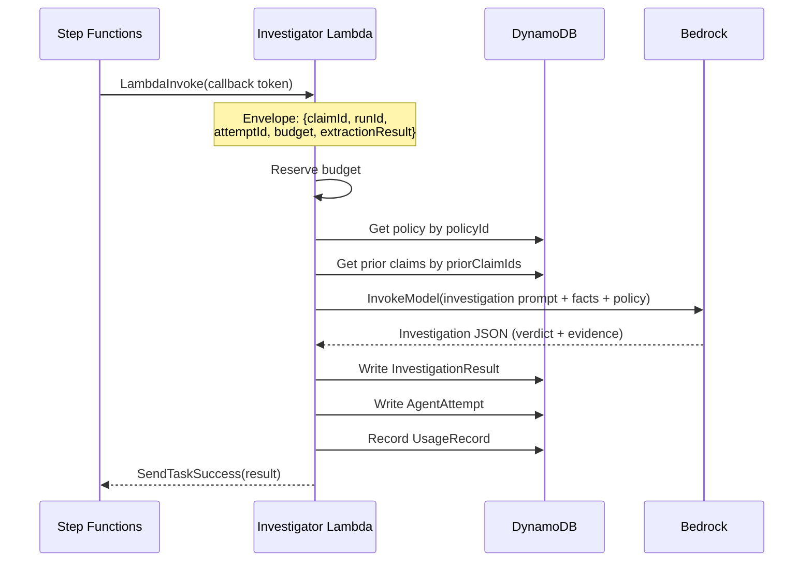
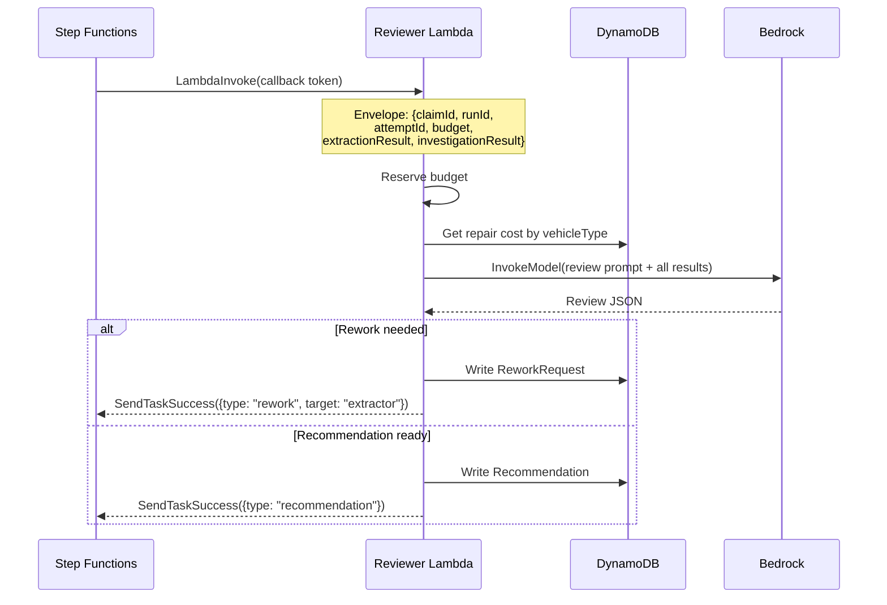
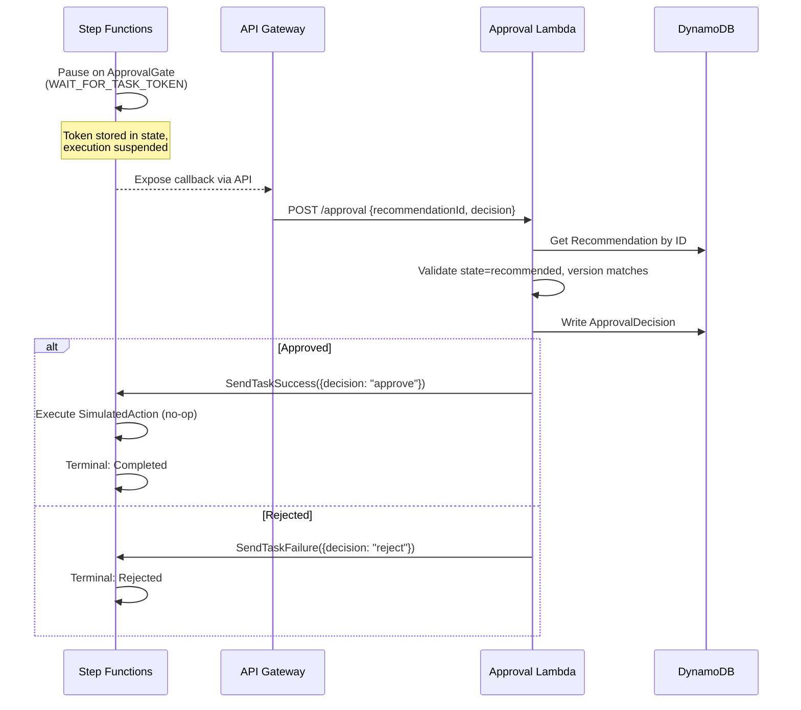
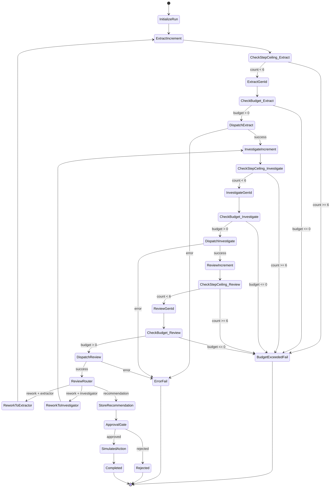
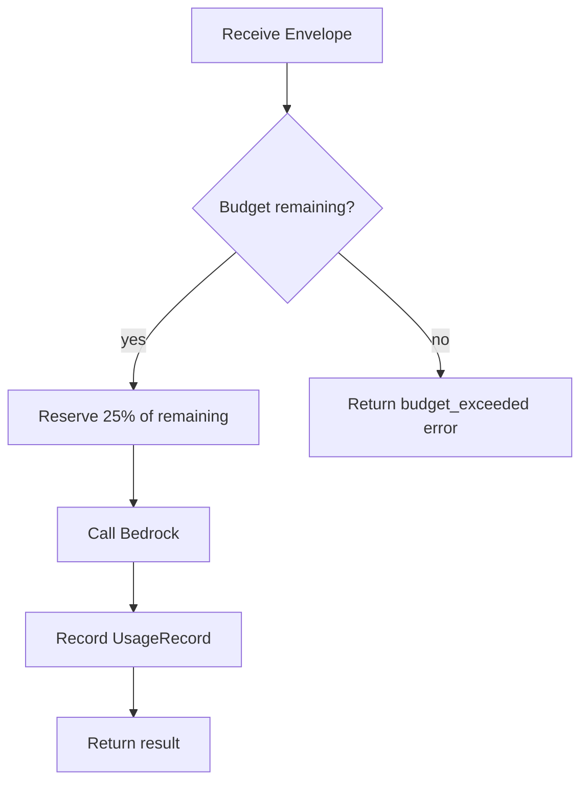
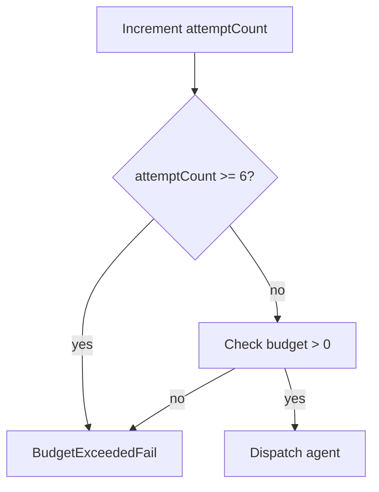

# Verdikt — Multi-Agent Claims Triage on AWS

An open-source, multi-agent insurance claims triage system. Decomposes claims processing into bounded, observable, replayable agents with hard cost ceilings and human approval gates.

## Table of Contents

- [About the Project](#about-the-project)
- [Design Principles](#design-principles)
- [High-Level Architecture](#high-level-architecture)
- [How a Claim Flows Through the System](#how-a-claim-flows-through-the-system)
- [State Machine Graph](#state-machine-graph)
- [Budget Enforcement](#budget-enforcement)
- [DynamoDB Schema](#dynamodb-schema)
- [Package Structure](#package-structure)
- [CloudWatch Observability](#cloudwatch-observability)
- [Synthetic Dataset](#synthetic-dataset)
- [Setup](#setup)
- [Domain Glossary](#domain-glossary)
- [Evaluation](#evaluation)
- [Troubleshooting](#troubleshooting)
- [Contributing](#contributing)
- [License](#license)

---

## About the Project

### What is Verdikt?

Verdikt is an open-source, multi-agent insurance claims triage system built entirely on AWS. It demonstrates how a complex business process — one that cannot be reliably handled by a single LLM prompt — can be decomposed into bounded, observable, and replayable agents with hard cost ceilings and human approval gates.

The system processes synthetic insurance claims through a pipeline of specialized AI agents, each responsible for one aspect of the triage process. A deterministic supervisor (AWS Step Functions) orchestrates the flow, enforces budget constraints, and ensures no action is taken without human authorization.

### The Problem It Solves

A regional insurer processes approximately 900 claims per day. Each claim requires:

1. **Document extraction** — pulling structured data from accident reports, repair estimates, and photos
2. **Policy verification** — cross-checking against policy limits and prior claims history
3. **Damage assessment** — sanity-checking repair estimates against known cost data
4. **Recommendation** — producing a written recommendation with supporting evidence

A single LLM prompt cannot reliably handle all of this. Even if it could, there is no way to:

- Audit why a specific conclusion was reached
- Resume a failed run without starting over
- Prevent the system from taking irreversible actions autonomously
- Enforce hard cost limits on AI inference

Verdikt solves these problems by decomposing the work into isolated agents, each with clear inputs and outputs, orchestrated by a state machine that enforces all constraints in code.

### Why It Exists

Verdikt exists to prove one thing: **a task too complex for a single prompt can be decomposed into bounded, observable, replayable agents — using AWS-native primitives instead of a hand-rolled state machine.**

It is a reference architecture demonstrating:

- How to build multi-agent systems with real guardrails
- How to enforce cost and step ceilings in code, not in prompts
- How to make every agent invocation auditable and replayable
- How to require human approval before any consequential action

### What It Demonstrates

Verdikt signals the difference between an engineer and a prompt hobbyist:

- **Termination conditions** — every run reaches a defined terminal state
- **Loop guards** — rework is bounded (max 6 attempts)
- **Cost ceilings** — enforced in code, not by prompt instruction
- **Human-in-the-loop** — no autonomous actions without approval
- **Full auditability** — every state transition is recorded and traceable

### Key Concepts

**Claim vs. TriageRun**: A claim is the input. A triage run is one execution of the supervisor graph for that claim. A claim can have many runs. A failed run does not mean a denied claim.

**Agents vs. Supervisor**: The agents (Extractor, Investigator, Reviewer) are the "brains" — they use Bedrock to reason about data. The supervisor (Step Functions) is the "traffic cop" — it routes work and enforces constraints but never makes decisions itself.

**Recommendation vs. Approval**: Agents recommend. Humans authorize. No money moves without an `ApprovalDecision` recorded in DynamoDB.

**Schema-first contracts**: All data flowing between agents is validated against Zod schemas at runtime. Invalid data is rejected immediately. TypeScript types are derived from the same schemas.

**Budget enforcement**: Every TriageRun gets a $2.00 spending envelope and a 6-attempt ceiling. These are enforced at two levels: in Lambda code (per-agent) and in Step Functions (per-run).

---

## Design Principles

- **Agent isolation** — each specialist (extractor, investigator, reviewer) runs in its own Lambda with its own timeout and memory. One agent crashing does not affect others.
- **Budget enforcement** — every TriageRun gets a $2.00 spending envelope enforced in code, not in prompts. Attempts are capped at 6.
- **Human authorization** — agents recommend. Humans decide. No money moves without an `ApprovalDecision`.
- **Replay safety** — every run state is snapshotted after each successful attempt. A failed run can resume from the last snapshot.
- **Full auditability** — every state transition is an immutable `RunEvent`. Every agent call is an `AgentAttempt`. CloudWatch dashboards and X-Ray traces are generated automatically.

---

## High-Level Architecture



---

## How a Claim Flows Through the System

### Phase 1: Extract

The Extractor receives raw claim documents (accident report, repair estimate, photo description) and extracts structured facts using Bedrock. Each fact is linked to its source document and section via an `EvidenceReference`.



### Phase 2: Investigate

The Investigator cross-checks the ExtractionResult against synthetic policy limits and prior claims. It reads reference data from DynamoDB (exact key lookups, no scans), then uses Bedrock to produce a verdict.



### Phase 3: Review

The Reviewer performs a sanity check. It reads both the ExtractionResult and InvestigationResult, then produces one of:

- **ReworkRequest** → routes back to Extractor or Investigator
- **Recommendation** → versioned written recommendation (proceed, reject, or flag)



### Phase 4: Approval Gate

When the Reviewer issues a Recommendation, the Step Functions state machine **pauses** using `WAIT_FOR_TASK_TOKEN`. The workflow is suspended until a human approves or rejects via the API.



---

## State Machine Graph

The Step Functions supervisor orchestrates all phases. Here is the full state machine:



---

## Budget Enforcement

Every TriageRun starts with a **$2.00 budget** and a **6-attempt ceiling**. These are enforced at two levels:

### Per-Agent Guardrails (in Lambda code)



Each agent reserves 25% of the remaining budget before calling Bedrock. This prevents one expensive agent from starving the others.

### Per-Run Guardrails (in Step Functions)



The Step Functions state machine checks the step ceiling and budget before every dispatch. If either is exceeded, the run terminates immediately with a `budget_exceeded` status.

---

## DynamoDB Schema

All state is stored in DynamoDB with single-table design patterns where appropriate.

### Core Tables

| Table | PK | SK | Purpose |
|---|---|---|---|
| `Claims` | `claimId` | `claimId` | Claim metadata |
| `TriageRuns` | `claimId` | `runId` | Run status, budget, attempt count |
| `AgentAttempts` | `runId` | `attemptId` | Per-agent invocation record |
| `ExtractionResults` | `runId` | `attemptId` | Extractor output |
| `InvestigationResults` | `runId` | `attemptId` | Investigator output |
| `ReviewResults` | `runId` | `attemptId` | Reviewer output |
| `Recommendations` | `runId` | `version` | Versioned recommendations |
| `Approvals` | `recommendationId` | `recommendationId` | Human decisions |
| `Snapshots` | `runId` | `version` | Run state checkpoints |
| `RunEvents` | `runId` | `timestamp` | Immutable audit trail |
| `Budgets` | `runId` | `runId` | Spending envelope |

### Reference Data Tables (read-only)

| Table | PK | Source |
|---|---|---|
| `SyntheticPolicies` | `policyId` | `fixtures/reference/policies.json` |
| `SyntheticPriorClaims` | `priorClaimId` | `fixtures/reference/prior-claims.json` |
| `SyntheticRepairCosts` | `vehicleType` | `fixtures/reference/repair-costs.json` |

---

## Package Structure

```
verdikt/
├── infra/                          # CDK infrastructure
│   └── lib/verdikt-stack.ts        # All 15 tables, SQS, Step Functions, API GW, CloudWatch
├── contracts/                      # Shared data models
│   └── src/schemas.ts              # 15 Zod schemas (Claim, TriageRun, AgentAttempt, etc.)
├── fixtures/                       # Synthetic test data
│   ├── claims/                     # 30 claims with expected outcomes
│   └── reference/                  # Policies, prior claims, repair costs
├── packages/
│   ├── extractor/                  # Extractor Lambda
│   ├── investigator/               # Investigator Lambda
│   ├── reviewer/                   # Reviewer Lambda
│   ├── approval/                   # Approval handler Lambda
│   ├── budget/                     # BudgetStore (reservation-based tracking)
│   ├── snapshot/                   # SnapshotStore + replay handler
│   └── logger/                     # Structured JSON logger + CloudWatch metrics
├── docs/
│   ├── adr/                        # 8 architecture decision records
│   └── Verdikt — Product Requirements Document.md
└── README.md
```

---

## CloudWatch Observability

### Dashboard

The CDK stack creates a `verdikt-operations` dashboard with:

| Widget | Metric | Purpose |
|---|---|---|
| Cost per Claim | `CostPerClaim` (Sum, 5min) | Track spending per run |
| Average Attempt Count | `AttemptCount` (Average, 5min) | Monitor agent efficiency |
| Rework Rate | `ReworkCount / TotalRuns` | Measure extraction/investigation quality |
| Error Rate | `ErrorCount / TotalRuns` | Detect agent failures |

### Alarms

| Alarm | Condition | Action |
|---|---|---|
| Budget Breach | `CostPerClaim > $2.00` | SNS notification |
| Error Rate | `Error / Total > 5%` for 3 periods | SNS notification |

### Structured Logging

All Lambdas emit JSON logs with:

```json
{
  "timestamp": "2025-01-15T10:30:00.000Z",
  "level": "INFO",
  "message": "Extraction completed",
  "claimId": "CLM-001",
  "runId": "run-abc123",
  "attemptId": "att-001",
  "agentType": "extractor",
  "costUsd": 0.12,
  "inputTokens": 1500,
  "outputTokens": 800,
  "durationMs": 3200
}
```

Logs are queryable via CloudWatch Insights using `claimId` and `runId` as indexed fields.

---

## Synthetic Dataset

30 claims covering all expected system behaviors:

| Scenario | Count | Expected Outcome |
|---|---|---|
| Straightforward claims | 8 | Approve on first pass |
| Rework then approve | 6 | Reviewer requests rework, then recommends approval |
| Rework then reject | 5 | Reviewer requests rework, then recommends rejection |
| Budget exceeded | 3 | Attempt ceiling or cost ceiling hit |
| Policy violation | 3 | Investigator flags coverage gap |
| Edge cases | 4 | Zero amount, missing docs, duplicates, invalid input |

Reference data: 8 policies, 7 prior claims, 15 repair cost records.

---

## Setup

### Prerequisites

- Node.js ≥ 20
- AWS CLI configured (`aws configure`)
- AWS CDK v2 (`npm install -g aws-cdk`)
- First deploy: `cd infra && npx cdk bootstrap`

### Install & Build

```bash
npm install
cd infra && npm install
cd .. && npm run build
```

### Deploy

```bash
cd infra && npx cdk deploy
```

Outputs include `StateMachineArn` and `ApprovalApiUrl`.

### Submit a Claim

```bash
aws stepfunctions start-execution \
  --state-machine-arn <StateMachineArn> \
  --input '{"claimId":"CLM-001"}'
```

### Approve a Recommendation

```bash
curl -X POST <ApprovalApiUrl>/approval \
  -H 'Content-Type: application/json' \
  -d '{
    "recommendationId": "<id>",
    "decision": "approve",
    "actor": "human@example.com"
  }'
```

### Run Evaluation

```bash
node scripts/eval.mjs
```

Results written to `eval-results.json`. Each claim's expected outcome is in `fixtures/claims/<claimId>.json` under `expectedOutcome`.

---

## API Endpoints

The system exposes a single API Gateway endpoint for human approval:

### POST /approval

Submit an approval decision for a recommendation.

**Request Body:**
```json
{
  "recommendationId": "rec-abc123",
  "decision": "approve",
  "actor": "human@example.com"
}
```

**Response:**
```json
{
  "approvalId": "approval-xyz789",
  "recommendationId": "rec-abc123",
  "decision": "approve",
  "timestamp": "2025-01-15T10:30:00.000Z"
}
```

**Error Codes:**
- `400` — Invalid request body
- `404` — Recommendation not found
- `409` — Recommendation already approved/rejected
- `500` — Internal server error

---

## Bedrock Model Configuration

The system uses Amazon Bedrock for all LLM inference. Each agent uses a different prompt template but the same model.

### Default Model

- **Model**: Anthropic Claude 3 Sonnet (or equivalent)
- **Max Tokens**: 4096
- **Temperature**: 0.0 (deterministic)

### Agent-Specific Configuration

| Agent | Purpose | Temperature | Max Tokens |
|---|---|---|---|
| Extractor | Structured data extraction | 0.0 | 4096 |
| Investigation | Policy/prior claim cross-check | 0.0 | 4096 |
| Reviewer | Sanity check and recommendation | 0.0 | 4096 |

### Prompt Templates

Each agent has a system prompt template that includes:
- Role definition
- Input schema (Zod-validated)
- Output schema (Zod-validated)
- Business rules and constraints
- Examples (where applicable)

Templates are stored in each agent's `prompts/` directory and loaded at runtime.

---

## Architecture Patterns

### Supervisor Pattern

The Step Functions state machine acts as a **deterministic supervisor** — it routes work between agents but never makes decisions itself. This is a key design choice:

- **Separation of concerns**: Orchestration (Step Functions) vs. intelligence (Bedrock)
- **Auditability**: Every state transition is recorded and traceable
- **Replayability**: Failed runs can resume from snapshots
- **Cost control**: Budget checks happen at the orchestrator level, not in prompts

### Agent Isolation

Each specialist agent runs in its own Lambda with:

- **Independent timeout**: 120 seconds per agent
- **Memory isolation**: 512 MB per agent
- **Error containment**: One agent failure doesn't crash others
- **Budget reservation**: Each agent reserves 25% of remaining budget

This prevents a single expensive agent from starving others or causing cascading failures.

### Schema-First Contracts

All data flowing between agents is validated against Zod schemas:

```typescript
// Example: ExtractionResult schema
export const ExtractionResult = z.object({
  schemaVersion: SchemaVersion,
  claimId: ClaimId,
  runId: RunId,
  attemptId: AttemptId,
  facts: z.array(ExtractedFact).min(1),
  missingDocuments: z.array(z.string()).optional(),
});
```

Benefits:
- **Runtime validation**: Invalid data is rejected immediately
- **Type safety**: TypeScript types derived from schemas
- **Documentation**: Schemas serve as living documentation
- **API contracts**: JSON Schemas generated for external systems

### Immutable Audit Trail

Every state transition creates a `RunEvent` record:

```json
{
  "eventId": "evt-abc123",
  "runId": "run-xyz789",
  "stateTransition": "ExtractDispatch → InvestigateIncrement",
  "fromState": "ExtractDispatch",
  "toState": "InvestigateIncrement",
  "timestamp": "2025-01-15T10:30:00.000Z"
}
```

This enables:
- **Compliance auditing**: Full history of every decision
- **Debugging**: Trace exactly where a run failed
- **Performance analysis**: Identify bottlenecks in the pipeline
- **Replay verification**: Confirm replayed runs reach the same state

### Human-in-the-Loop Design

The approval gate uses Step Functions' `WAIT_FOR_TASK_TOKEN` integration:

1. Reviewer produces a Recommendation
2. Step Functions pauses execution
3. Recommendation is exposed via API Gateway
4. Human approves/rejects via API call
5. Step Functions resumes with the decision

This ensures:
- **No autonomous actions**: Money never moves without human approval
- **Auditability**: Every approval is recorded with actor and timestamp
- **Flexibility**: Approval can come from UI, Slack, webhook, etc.
- **Timeout handling**: Unapproved recommendations expire after 24 hours

---

## Design Tradeoffs

| Decision | Alternative | Why This Choice |
|---|---|---|
| Step Functions | LangGraph, Temporal | AWS-native, no additional infrastructure, built-in observability |
| DynamoDB | PostgreSQL, RDS | Serverless, no connection pools, scales automatically |
| Lambda | ECS Fargate | Lower cost for short-lived tasks, auto-scaling |
| Bedrock | OpenAI, Anthropic | AWS-native, no data leaving AWS, integrated billing |
| SQS | Direct Lambda invoke | Async decoupling, dead-letter queues, retry handling |
| Zod schemas | JSON Schema only | Runtime validation + TypeScript types + documentation |
| SimulatedAction | Real payout | Safety for demo, no real money movement |

---

## Security Considerations

### IAM Least Privilege

Each agent Lambda has minimal permissions:

- **Read/Write**: Only DynamoDB tables it needs
- **Bedrock**: Only `InvokeModel` action
- **SQS**: Only send/receive on specific queues
- **X-Ray**: Active tracing enabled

### Data Protection

- **No real data**: All claims are synthetic
- **No secrets**: Environment variables only for table names
- **Encryption**: DynamoDB encryption at rest enabled
- **VPC**: Lambdas can be deployed in VPC for additional isolation

### Audit Logging

- **CloudWatch Logs**: All Lambda invocations logged
- **X-Ray Traces**: End-to-end execution traces
- **DynamoDB**: Point-in-time recovery enabled
- **Step Functions**: Execution history retained

---

## Domain Glossary

The project uses precise domain terminology documented in `CONTEXT.md`. Key terms:

| Term | Definition |
|---|---|
| **Claim** | A synthetic insurance claim submitted for triage. One claim may have many TriageRuns. |
| **TriageRun** | One execution of the supervisor graph for a Claim. Has its own execution status. |
| **AgentAttempt** | One invocation of one specialist agent within a TriageRun. |
| **ReworkRequest** | A typed request from the Reviewer to re-run either the Extractor or Investigator. |
| **ExtractionResult** | Schema-validated structured output from the Extractor with provenance links. |
| **InvestigationResult** | Cross-check of an ExtractionResult against policy limits and prior claims. |
| **ReviewResult** | Either a ReworkRequest or a Recommendation. |
| **Recommendation** | A versioned written recommendation produced by the Reviewer. |
| **ApprovalDecision** | A human decision (approve or reject) on a specific Recommendation version. |
| **BudgetAccount** | Per-TriageRun spending envelope enforced in code, not prompts. |

**Key Distinctions:**
- Claim ≠ TriageRun — A claim can have many runs. A failed run does not mean a denied claim.
- Recommendation ≠ ApprovalDecision — Agents recommend. Humans authorize.
- AgentAttempt ≠ logical step — Retries and rework create additional attempts.

---

## Evaluation

### Running the Evaluation

```bash
node scripts/eval.mjs
```

Results are written to `eval-results.json`. Each claim's expected outcome is in `fixtures/claims/<claimId>.json` under `expectedOutcome`.

### Evaluation Metrics

| Metric | Description |
|---|---|
| **Terminal State Accuracy** | Does the run reach the expected terminal state? |
| **Attempt Count** | How many attempts did the run take? |
| **Cost Per Claim** | Total Bedrock cost for the run |
| **Rework Routing** | Did rework go to the correct specialist? |
| **Approval Gate** | Was the recommendation properly blocked until human approval? |

### Test Claims

30 claims covering all expected system behaviors:

| Scenario | Count | Expected Outcome |
|---|---|---|
| Straightforward claims | 8 | Approve on first pass |
| Rework then approve | 6 | Reviewer requests rework, then recommends approval |
| Rework then reject | 5 | Reviewer requests rework, then recommends rejection |
| Budget exceeded | 3 | Attempt ceiling or cost ceiling hit |
| Policy violation | 3 | Investigator flags coverage gap |
| Edge cases | 4 | Zero amount, missing docs, duplicates, invalid input |

---

## Troubleshooting

### Common Issues

| Issue | Cause | Solution |
|---|---|---|
| `BudgetExceeded` error | Run exceeded $2.00 budget or 6 attempts | Check Bedrock model costs; review agent prompts for efficiency |
| `UnexpectedReviewOutcome` error | Reviewer returned unexpected outcome type | Verify Reviewer Lambda schema validation |
| Lambda timeout | Agent exceeded 120s timeout | Check Bedrock model response times; increase timeout if needed |
| DynamoDB throttling | Too many concurrent runs | Enable on-demand billing mode (already configured) |
| API Gateway 5xx | Approval handler error | Check Lambda logs in CloudWatch |

### Debugging Steps

1. **Check CloudWatch Logs**: All Lambdas emit structured JSON logs with `claimId` and `runId`
2. **Inspect DynamoDB**: Query tables using `claimId` or `runId` as partition key
3. **X-Ray Traces**: View end-to-end execution traces in X-Ray console
4. **Step Functions Console**: Visualize state machine execution and identify failure points

### Useful Queries

```bash
# Check budget for a run
aws dynamodb get-item \
  --table-name Verdikt-BudgetsTable \
  --key '{"budgetId": {"S": "<runId>"}}'

# Get all events for a run
aws dynamodb query \
  --table-name Verdikt-EventsTable \
  --index-name ByRun \
  --key-condition-expression "runId = :rid" \
  --expression-attribute-values '{":rid": {"S": "<runId>"}}'

# Check approval status
aws dynamodb get-item \
  --table-name Verdikt-ApprovalsTable \
  --key '{"approvalId": {"S": "<approvalId>"}}'
```

---

## Contributing

### Development Workflow

1. Fork the repository
2. Create a feature branch (`git checkout -b feature/my-feature`)
3. Make changes and add tests
4. Run tests (`npm test`)
5. Submit a pull request

### Code Style

- TypeScript strict mode enabled
- Zod schemas for runtime validation
- Structured JSON logging
- AWS CDK for infrastructure

### Testing

```bash
# Run all tests
npm test

# Run specific package tests
cd packages/extractor && npm test
cd contracts && npm test

# Run infrastructure tests
cd infra && npm test
```

---

## License

MIT
